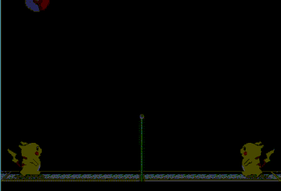

# 皮卡丘打排球 AI

## DEMO

分數趨勢\

## 關於
透過`DQN`的方法訓練AI玩`皮卡丘打排球`

整體操作框架採用 [SerpentAI](https://github.com/SerpentAI/SerpentAI)

遊戲內資訊透過windows API直接抓取內存

(事先透`CheatEngine`抓取記憶體偏移值)

以省去`OpenCV`辨識各種資訊的步驟

雖然遊戲執行檔已經事先用`Resource Hacker`簡化畫面了\
(給`OpenCV`用的)

相關[訓練成果GIF](https://github.com/pionxzh/AI-PikaBall/image/)及模型詳見各資料夾

## 環境安裝

+ [SerpentAI](https://github.com/SerpentAI/SerpentAI/wiki/Home_zh_cn)

## 開啟redis
`sudo sed -i -e 's/127.0.0.1/0.0.0.0/g' /etc/redis/redis.conf`

`sudo service redis-server restart`

## 啟動遊戲
`serpent launch PikaBall`

## 擷取畫面 0.2秒一次 (不需執行此行)
`serpent capture frame PikaBall 0.2`

## 開始訓練
`serpent play PikaBall PikaBallGameAgent`

讀取模型會到model/action 跟 model/move抓取最後一個值最小的
